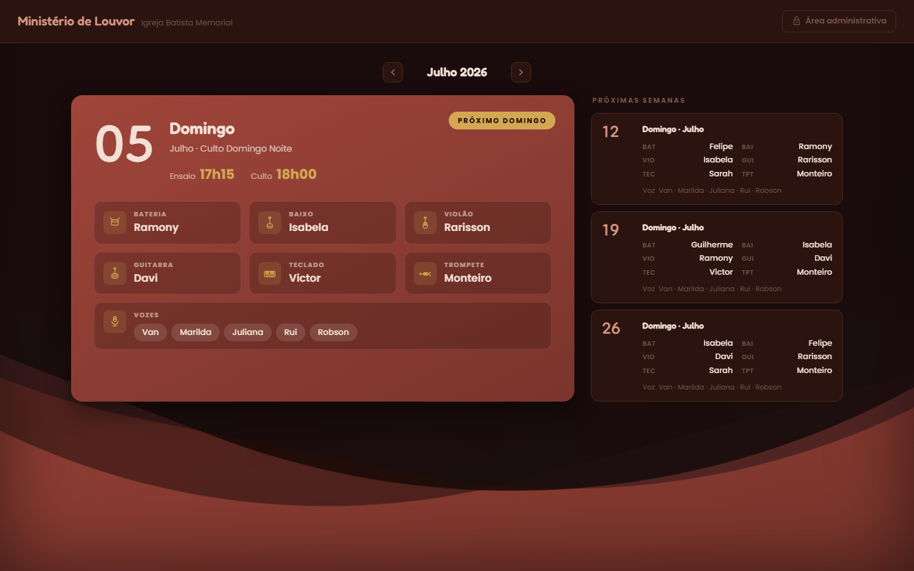
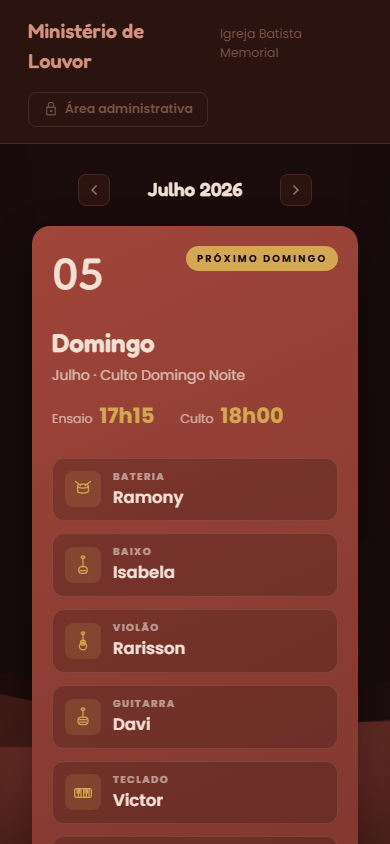
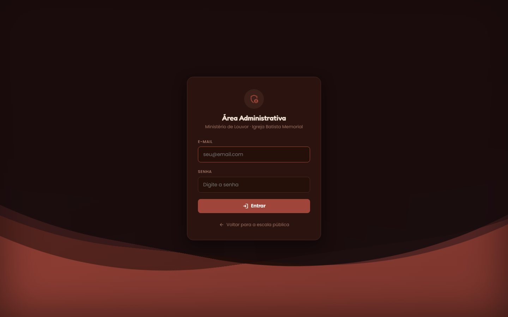

# Escala de Louvor — Igreja Batista Memorial

Sistema web para gerenciar a escala do Ministério de Louvor de uma
igreja: uma página pública com a escala do mês, sincronizada em tempo
real, e uma área administrativa onde quem organiza a escala cadastra
cultos, define quem toca cada instrumento, gerencia a equipe e exporta
a escala como imagem para o WhatsApp.

**Ao vivo:** [memorial-louvor.web.app](https://memorial-louvor.web.app)



<table>
<tr>
<td></td>
<td></td>
</tr>
</table>

## Funcionalidades

**Página pública**
- Card em destaque para o próximo domingo (calculado pela data atual), com instrumentistas, horários e vozes escaladas.
- Lista das próximas semanas do mês, navegação entre meses.
- Sincroniza em tempo real: uma edição do admin aparece na hora, sem precisar recarregar.
- Layout paisagem para desktop e responsivo para celular.

**Área administrativa** (`/admin`, login com e-mail/senha)
- **Escala:** cria, edita e exclui cultos; define o instrumentista de cada função (bateria, baixo, violão, guitarra, teclado, trompete) e as vozes, tudo com dropdowns customizados.
- **Geração automática de domingos:** um clique cria um culto para cada domingo do mês selecionado, pulando os que já existem.
- **Músicos:** cadastro da equipe com funções (múltiplas por pessoa) e toggle de disponibilidade.
- **Exportar:** gera a escala como imagem PNG em dois formatos — paisagem (1280×720, ideal para WhatsApp) e retrato (1080×1920, para status/stories) — com o domingo em destaque e as próximas semanas.

## Stack

- **Front-end:** React 19 + TypeScript + Vite, React Router.
- **Dados:** Firebase Firestore (tempo real) + Firebase Authentication (e-mail/senha).
- **Hospedagem:** Firebase Hosting.
- **Exportação de imagem:** html2canvas.
- **Fontes:** Poppins, Fredoka e Dongle (Google Fonts). **Ícones:** Material Symbols + SVGs próprios para os instrumentos.
- Sem CSS framework — design system próprio com CSS Modules e variáveis de tema (paleta terracota/dourado/sálvia sobre fundo escuro).

## Rodando localmente

```bash
npm install
npm run dev
```

Acesse `http://localhost:5173`. A configuração do Firebase já está em
`src/firebase/config.ts` (é a configuração pública do projeto — ver
nota de segurança abaixo).

## Autenticação

O login em `/admin` usa **Firebase Authentication com e-mail e senha**.
Não existe cadastro pelo site — as contas são criadas manualmente em
*Firebase Console → Authentication → Users → Add user*. Qualquer conta
criada lá consegue entrar; para dar acesso a mais pessoas (outros
líderes de louvor), basta criar mais usuários por lá.

## Banco de dados

Os dados (cultos e membros) ficam no **Firestore** (projeto
`memorial-louvor`). Na primeira vez que o banco estiver vazio, o app
popula automaticamente com os dados iniciais (`src/data/seed.ts`) —
mas só quando um admin autenticado carrega a página, já que o seed faz
uma escrita e a regra de segurança exige login para isso. Todo o
acesso a dados passa por `src/data/repository.ts` — se um dia trocar
de backend, só esse arquivo muda.

### Regras do Firestore

Configuradas em *Firebase Console → Firestore Database → Regras*:

```
rules_version = '2';
service cloud.firestore {
  match /databases/{database}/documents {
    match /{document=**} {
      allow read: if true;
      allow write: if request.auth != null;
    }
  }
}
```

Qualquer pessoa **lê** a escala (necessário para a página pública),
mas só quem estiver logado (com uma conta criada manualmente no
Firebase Console) consegue **escrever** — mesmo que alguém descubra a
configuração do Firebase (que não é segredo, é pública em qualquer app
web) ou tente burlar o front-end.

## Deploy

```bash
npm run build
npx firebase-tools deploy --only hosting
```

`firebase.json` já configura o rewrite de SPA (para as rotas do React
Router funcionarem em refresh direto) e cache-control (`no-cache` no
HTML, para deploys novos aparecerem na hora; cache longo e imutável
para os assets com hash).

## Estrutura do projeto

```
src/
  firebase/     configuração do Firebase (app, Firestore, Auth)
  data/         tipos, dados de seed e repository (Firestore)
  context/      estado global: escala (cultos/membros), autenticação, toast
  components/
    icons/      ícones dos instrumentos (SVG) + wrapper do Material Symbols
    layout/     cabeçalho e layout da área administrativa
    schedule/   componentes da escala (lista, editor, hero, dropdown)
    members/    componentes da equipe
    export/     templates usados para gerar a imagem (paisagem/retrato)
    common/     botão, modal, toast, empty state, dropdown, fundo animado
  pages/        as telas (pública, login, escala, músicos, exportar)
```

## Protótipo anterior

A versão anterior (single-file, sem backend real, primeiro rascunho)
foi guardada em `_prototipo-antigo/` só como referência de como o
projeto começou.

## Licença

MIT — veja [LICENSE](LICENSE).
